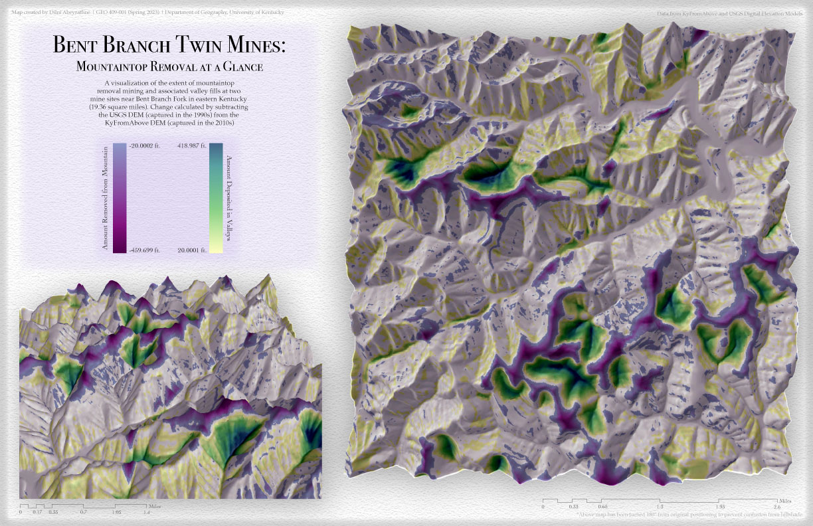
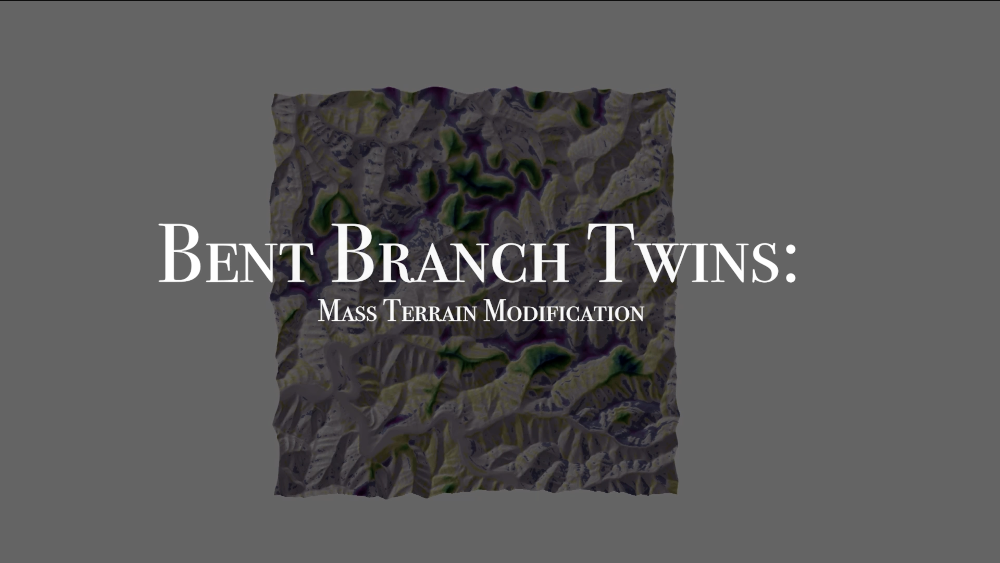

# bent-branch-MTR-change
## Evidence of Mountaintop Removal Mining and Valley Fills in Two Mining Sites

From the 1990s to the 2010s, the two mountain ranges on either side of Bent Branch Road in Pikeville, Kentucky exhibited significant mountaintop removal on several peaks (visualized in violet shades) and subsequent valley fills in several adjacent valleys and mountainsides (visualized in green shades). 

     
*Map of mass terrain modification in the twin MTR sites of Bent Branch Road.* [Link to high-resolution PDF](M6_BentBranchMTR.pdf)     

     
*Brief animation showcasing a fly-by of the extent of mountaintop removal and valley fills in Bent Branch.* [Bent Branch Twins (MTR and Valley Fills Visualization)](https://youtu.be/pTUduVC-E-E) 

This map & animation were created by Dilni Abeyrathne @DTAbeyrathne for the GEO409-001 (Spring 2023) class in the University of Kentucky’s Department of Geography. Datasets used in the map were sourced from USGS (1990s) and KyFromAbove (2010s) Digital Elevation Models. This webpage visualization was published on April 10th, 2023.